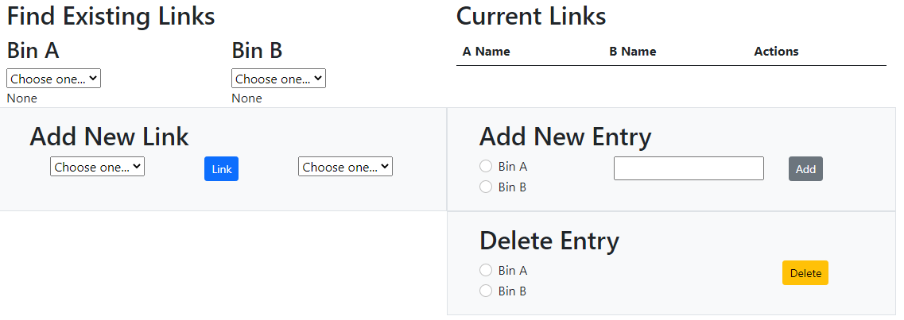

# bidirectionalMapper
Simple many-to-many link manager

Map one list to another - many-to-many - in a single page web app
# Screenshot
Note: shows an empty database (as distributed)

# Installation
1. `git clone git@github.com:jolewis-ddn/bidirectionalMapper.git`
2. `cd bidirectionalMapper`
3. `npm install`
4. `node server.js`
5. Open [http://localhost:9519/](http://localhost:9519/)
# Uses
- Vue (for web page - via unpkg.com)
- Sqlite3 (for db - sample empty database provided)
- Better-sqlite3 (Node module to interact with db)
# Features
- Single JavaScript file exposes Rest API and serves web page (index.html)
- Rest API to update the database
- Single page app (uses Vue for UI and Fastify for Rest API)
- Web page auto-refreshes on data changes (n.b. only when data is updated _within the app_)
# Not Supported
- Authentication: either to use, add, or remove entries
- Monitoring data for changes outside the app
# To Do
- Enable changing the name shown for the Bins in the HTML
